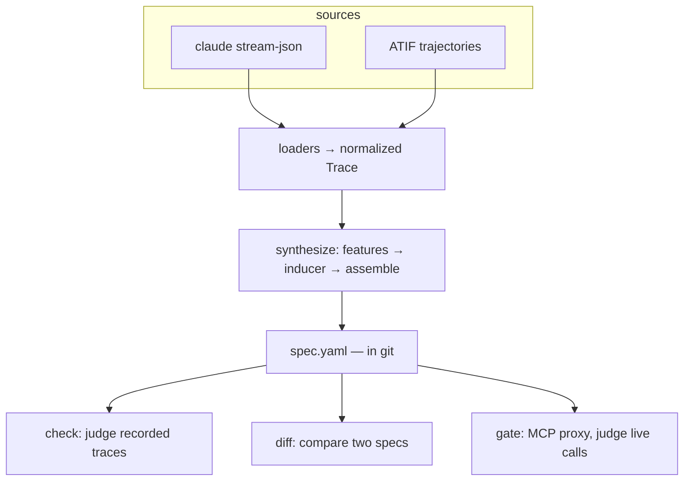
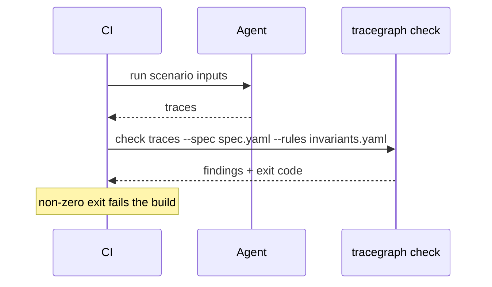
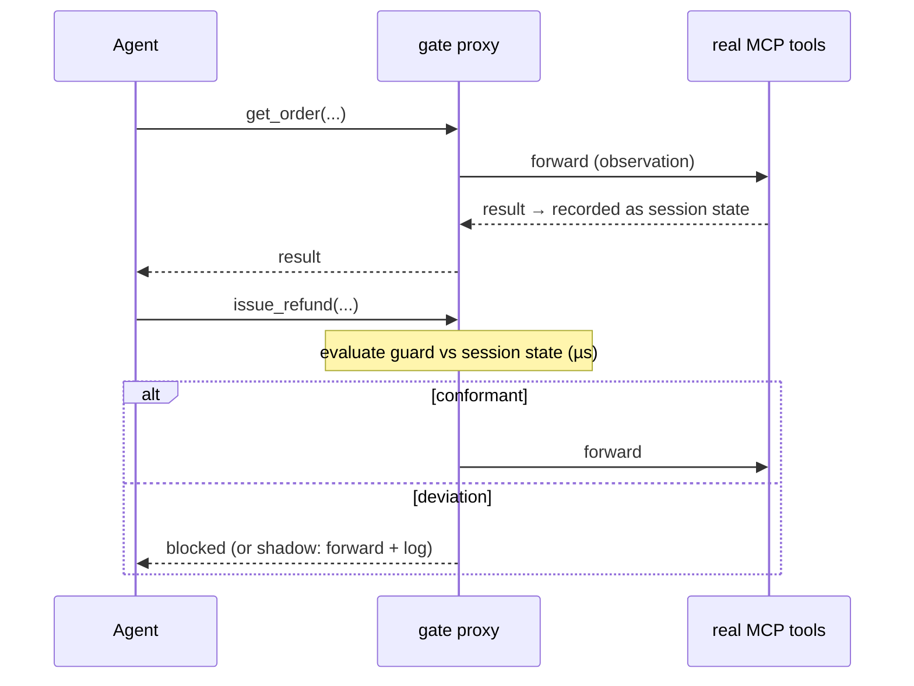

# tracegraph architecture

The one idea: **the spec is a document, not a program.** `synthesize` writes
it; `check`, `diff`, and `gate` read it. Nothing in this package executes
agents or tools — tracegraph is the type checker, not the runtime.

## Modules

| Path | Responsibility |
|---|---|
| `src/trace/` | loaders (`atif.ts`, `stream-json.ts`) → one normalized `Trace` model; agent-namespace canonicalization |
| `src/synth/` | `features.ts` (FeatureAccumulator — state visible at a point in time), `inducer.ts` (gini decision tree → DNF guards), `cluster.ts` (population detection for messy dirs), `assemble.ts` (mapping, data-flow lift, load-bearing analysis), `index.ts` (action auto-detect, orchestration) |
| `src/spec/` | the document: types (CallStep/GateStep, GuardExpr DNF), YAML io + validation |
| `src/check/` | action-time evaluation of traces against spec + invariant rules file |
| `src/diff/` | structural + clause-level + behavioral (sample decision agreement) comparison |
| `src/gate/` | (week 2) MCP proxy reusing check's evaluator on a live stream |

## Design rules the code enforces

1. **Action-time state, everywhere.** Guards are induced from and evaluated
   against the state visible *at the moment of action* (`FeatureAccumulator`).
   Whole-trace features would let post-action calls launder pre-action
   state — found the hard way via a real bad trace.
2. **Only successful actions count as taken.** Transport errors and
   business-level rejections (`ok:false`, `error` fields) are not behavior
   to encode — but they remain visible to `check`.
3. **Identifiers and error payloads never become guard features.**
4. **Task inputs are auto-lifted.** An arg whose literal varies across
   traces is an input (`${input.order_id}`), not behavior.
5. **Domain (MCP) tools outrank harness tools** for action detection;
   harness noise (Read/Write/ToolSearch) can appear in specs but is marked
   non-load-bearing and excluded from behavioral diffs.
6. **Heterogeneous directories are detected, not averaged.** Vocabulary
   clustering warns and splits rather than synthesizing nonsense.

## Data at rest

v1 stores nothing itself: traces stay where agents wrote them; the spec and
invariants live in git (PR-reviewable, versioned with the agent); check
reports are CI artifacts; the gate writes an append-only JSONL decision log.
The platform phase (see ROADMAP §4) maps each file to a database successor
(spec.yaml → spec_version, gate log → gate_decision audit) and adds
env_binding + calibration_set.

## Sequences

CI regression (the spec enters from git, not a service):

Gate (session state accumulates by proxying; decision time is pure memory):

## Where an engine re-enters (not in this package)

Live execution of the spec — probe farms, spec-as-scaffold agents, durable
human-in-the-loop flows — needs retries, resumability, and event history.
That is the btree/Temporal layer (`@q1k-oss/behaviour-tree-workflows`,
where the spec loads via its Registry — proven at 204/204 decision
agreement during the spike). Deliberately outside v1's dependency tree; see
DECISIONS #6 and ROADMAP phase 4.
